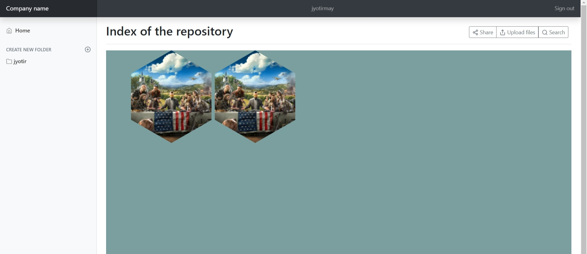
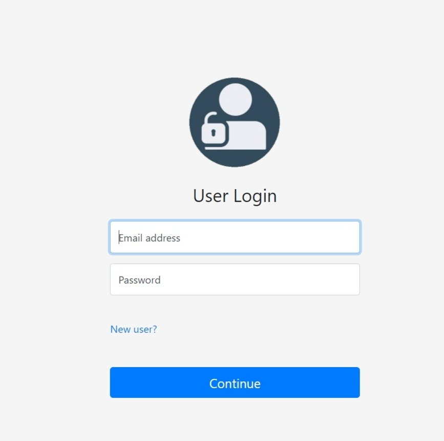
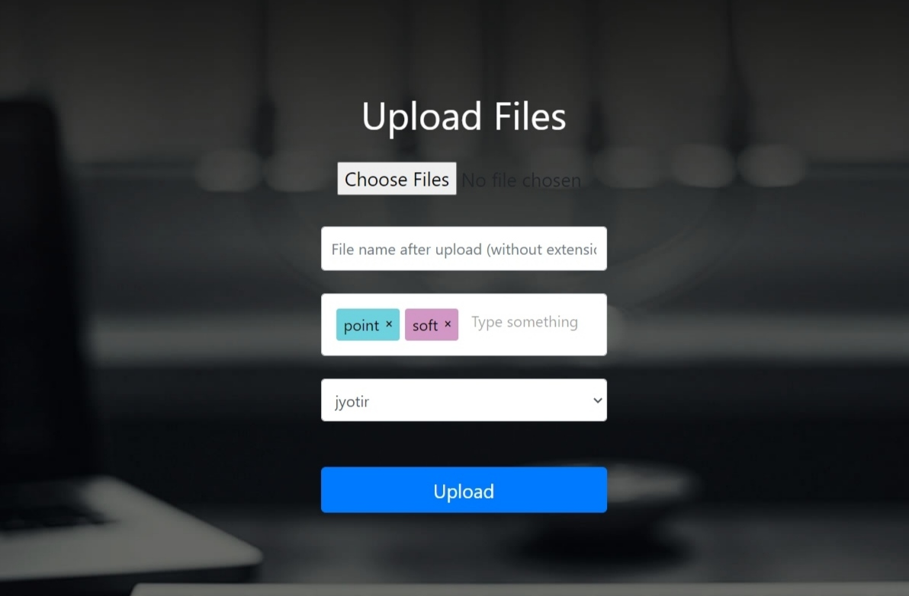

# Project Title

Repository Management Software

### Getting Started


## Prerequisites

Xampp


<Project>: The Upload management syste,


### Installation instructions

1. Download XAMPP for your system from https://www.apachefriends.org/index.html.
2. Run the executable and select atleast Apache, PHP, MySQL, Fake Sendmail and phpMyAdmin to install.
3. Install at any desired location, for now we assume it to be the default, 'C:\xampp'
4. git clone this repo or download this repo as zip file and extract it to 'C:\xampp\htdocs', replace 'C:\xampp' with path to your XAMPP installation directory.
5. Import the 'signup (2).sql' into your database using phpMyAdmin
6. Edit the connect.php and config.php to point to your MySQL server, and fill in the credentials you used to complete Step-5

##Optional steps to enable password resetting mails:
1. Open your PHP configuration file placed at 'C:\xampp\php\php.ini' in a text editor, replace 'C:\xampp' with path to your XAMPP installation directory.
2. scroll down to the following lines independently:

```
SMTP=localhost
smtp_port=25
;sendmail_path =
;mail.force_extra_parameters =
```

and change them to (replace 'C:\xampp' with path to your XAMPP installation directory.):

```
;SMTP=localhost
;smtp_port=25
sendmail_path = "C:\xampp\sendmail\sendmail.exe"
mail.force_extra_parameters = "-t"
```

3. Now open "C:\xampp\sendmail\sendmail.ini" in a text editor, replace 'C:\xampp' with path to your XAMPP installation directory.
4. Change the setting to the ones required by your custom smtp server(like, the one used for internal emails) or to your email provider's smtp server(like, the ones provided by larger networks in public domain)
5. Open the location where you saved this repository and edit the conf.php ```$context``` to point to your http server's FQDN and ```$sender_email``` to the email address from which you will be sending the emails, as configured in the optional Step-4
6. Restart your Apache server


## Features
- Registration on the system with Name, Operating Company, and Enterprise Email ID as mandatory fields (All are text fields)
- Ability to create a new folder and give it a unique name – eg. “Sales Productivity Kaizen”
- The user-created folder automatically becomes a subfolder of the repository’s standard folders named as per Year and Month eg. 2019-March
- User can add requisite documents (PPT, Word, Excel, PDF), photos, and event videos to the folder created by them
- All users have read-only access to all folders created by others
- Users can edit only those folders which they have themselves created
- Ability to search by tags and filename

<p align="center">
  
  </p>
  <p align="centre">
  
</p>
<p align="center">
  
  </p>
      


